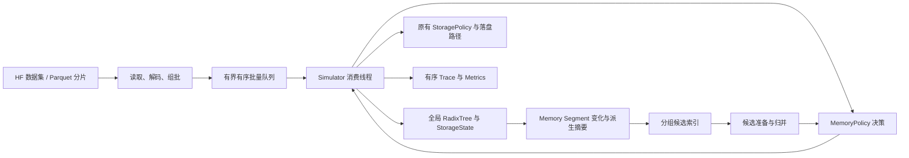

# DWPDSim 批量输入与 MemoryPolicy 分组 Segment 淘汰性能设计

状态：已实现可选实验版本，位于 `perf/memory-segment-lru`；默认仍使用原始 Memory LRU。
消融结果与复现命令见 [实验报告](memory-ablation-report.md)。

源码基线：`main @ 82fbcbd3a5c477665f236042f2bf85515ad6f795`。

本文定义输入流水线、MemoryPolicy 的 segment 候选索引及并行选择的设计约束。
当前策略优化范围仅限 MemoryPolicy，任何 StoragePolicy 均不改动。现有运行语义见
[vNext Policy 设计](../vnext-policy-refactor.md)。各个优化项独立配置，实际收益以实验报告为准。

## 1. 目标、规模与范围

目标场景是 SLC+TLC 总容量约 64T、每个 `hash_id` 对应几 MB KV block 的回放。
已报告的现象是约 14 万请求生成超过 3 亿 events，且处理速度随运行下降。这是用户提供的
运行现象；尚未取得该次运行的 metrics、配置和分段性能数据，不能据此确认根因。

优先解决以下问题：

1. 输入读取、解码和 buffer 构造与模拟执行串行。
2. 每次 victim 选择扫描全部 block 状态，成本随驻留规模和回收频率增长。
3. segment 变化后缺少可增量维护的候选索引。
4. 候选准备和索引维护缺少明确的并行边界。

设计范围包括：

- 统一 Hugging Face Datasets 可读取的数据 schema；
- 有界批量输入队列及输入、处理解耦；
- 一棵全局 RadixTree 上的 segment 描述和分组候选索引；
- segment 分裂、合并、延长、缩短时的索引更新；
- 精确分组选择与可单独配置的近似 LRU；
- 性能、确定性和模拟结果偏差验证。

当前仅优化 MemoryPolicy 的候选管理和 victim 选择。StoragePolicy 的接口、实现、状态、
通知协议、placement、admission、容量回收、迁移和后台维护全部保持现状，不接入分组索引。
MemoryPolicy 返回的 Dump 继续由 Simulator 调用原有落盘路径处理；其他算法插件不做优化。
近似 Memory LRU 是明确可选的策略变体，不静默替换精确模式。

全局 RadixTree 仅为 Memory 候选管理提供必要的拓扑变化信息，不改变 segment 定义。
Storage 操作导致的剪枝由 Simulator/RadixTree 既有状态转换处反映到 Memory 派生索引，
不要求 StoragePolicy 发送新的通知。输入批量队列保留为独立优化项。

Trace 异步输出、MQSim converter 流式化属于独立优化议题，本方案不改变其输出协议。

### 1.1 容量换算

按总容量 64 TiB、存储装满计算：

| 每块大小 | 落盘 block 数 | 仅对应 NodeRecord 的空间 |
| --- | ---: | ---: |
| 2 MiB | 33,554,432 | 2.5 GiB |
| 4 MiB | 16,777,216 | 1.25 GiB |
| 8 MiB | 8,388,608 | 640 MiB |
| 16 MiB | 4,194,304 | 320 MiB |

空间基于当前头文件在本机 C++17 编译器下的 `sizeof(Node)=56`、`sizeof(NodeRecord)=80`。
这不是进程 RSS：不含哈希索引、policy entries、仅在 Memory 中的节点、必要拓扑节点、
请求历史、容器预留空间和输入缓冲。节点按实际回放创建，不因配置 64T 就预创建全部节点。
实际配置必须记录字节数，区分 TB 与 TiB。
64T 是存储容量背景，不是 Memory 候选数量；本轮主要工作集应按实际 Memory 容量、
驻留 block 数和符合资格的 segment 数测量。

## 2. 保持的语义与所有权

- 全局只有一棵 RadixTree。Memory、SLC、TLC 是其驻留集合，分组不产生独立子树或固定容量配额。
- `NodeId` 仍等于输入 `hash_id`。分组编号、segment 管理句柄和版本号不是新的 block 身份。
- Simulator 协调逻辑状态转换；RadixTree 持有节点与拓扑，StorageState 持有容量与地址。
- 请求、请求内 block、虚拟时间 tick 和 I/O 提交保留规定顺序。宿主机线程完成时间不决定模拟时间。
- 拓扑变化不移动 KV payload，不生成 READ/WRITE/TRIM，也不凭空改变驻留和 program bytes。
- 只有无 Memory/Storage 副本且无子节点的节点才可剪枝；同一 hash 删除后重现是新生命周期。
- 近似模式只允许改变合法候选之间的选择。Memory leaf 资格、容量约束和现有 I/O 依赖必须准确。

## 3. 整体结构



输入准备与 C++ 回放可以重叠；候选管理可以按组执行。逻辑树修改、容量分配和淘汰提交
继续由 Simulator 按顺序推进。worker 不并发修改 RadixTree。

## 4. 输入规范与批量队列

### 4.1 数据 schema

建议以 Parquet 分片保存，支持本地或 Hugging Face Hub 来源。四个业务字段固定如下：

| 字段 | 类型 | 约束 |
| --- | --- | --- |
| `timestamp_ns` | `uint64` | 跨请求、分片和 batch 非递减 |
| `request_id` | `uint64` | 一次回放内全局唯一 |
| `affinity_id` | `uint64` | 保留现有语义，包括零值 |
| `hash_ids` | `list<uint64>` | 完整有序路径，保留重复 block 访问 |

字段及列表元素不允许 null；空路径沿用当前接口行为。不得通过去重、shuffle 或重新按
request ID 排序改变访问序列。相同 timestamp 的请求按确定的输入行顺序回放。

数据集元信息记录 schema 版本、时间原点、split、明确的分片顺序，以及来源版本。
Hub 来源固定 revision；本地来源记录文件标识。元信息不增加为逐请求业务字段。
绝对时间与相对时间不得隐式转换；时间原点必须与后台 tick 和 simulation end 的定义一致。

### 4.2 内部 RequestBatch

```text
batch_sequence
timestamps_ns[N]
request_ids[N]
affinity_ids[N]
offsets[N + 1]
hash_ids[M]
```

五个数据 buffer 均符合现有 C++ `process_batch` 的连续 `uint64` 要求。
第 i 条请求为 `hash_ids[offsets[i]:offsets[i+1]]`，offset 从零开始并覆盖整个 hash buffer。
`batch_sequence` 是内部交付序号，不替代 `request_id`。

生产端完成解码、必要校验和 buffer 构造；消费端直接调用批量接口。避免逐行构造 Request
对象再逐个跨 Python/C++ 边界。Parquet 解码、Arrow offset 类型转换和分块拼接可能需要
拷贝，不将整条输入链路描述为零拷贝。

### 4.3 队列契约

- 队列同时受在途字节预算和 batch 数限制；预算包含正在构造、待交付和正在消费的
  自有 uint64 buffer。读取下一批前按最大 batch 字节数预留，构造后缩减为实际大小。
  Arrow/HF 解码 workspace 不在此预算内，按单个解码 batch 的行数限制；它不是进程 RSS 上限。
- 按请求数、hash 总量组批，防止变长请求造成无法控制的内存占用。
- 不在 batch 边界拆开业务请求。超长请求单独成批，必须在配置的单请求和总预算内；
  超限在输入边界明确失败，不能永久等待一个不可能取得的队列空间。
- 入队后的 buffer 不可修改；消费调用返回前保持其底层所有者存活，不得复用空间。
- 队列满时生产端等待，队列空时消费端等待。不得因等待改变输入顺序。
- 当前仅一个输入 producer，不需要重排缓存；按连续 batch 序号交付。
- 正常 EOF 后消费最后一个 batch，再调用 `finish()`；错误和取消唤醒相关队列等待者并向上报告；正在执行的源 I/O 返回后 producer 才能退出。
- 不自动重放部分执行失败的 batch；输入队列不提供模拟器状态回滚或断点恢复语义。

第一阶段采用进程内生产者与消费线程，利用现有 batch 调用释放 GIL 的行为重叠工作。
多生产者、跨进程共享内存和外部消息中间件不作为初始依赖。

## 5. Segment 描述与候选索引

### 5.1 Segment 与候选分别维护

Segment 是全局拓扑上由单子链构成的逻辑范围。分叉节点属于上方 segment；它的每个子节点
开启下方 segment。endpoint 是叶节点或分叉节点。虚拟 root 不属于业务 segment。

Segment 描述是拓扑的派生索引，只保存边界、摘要、版本和管理归属，不复制 parent/children
图或全部 block 驻留表。非候选 segment 也可能需要描述，以便其成为 leaf 或发生合并时更新。
组内有序索引包含有 Memory 驻留的 segment；查询时通过 Memory 子树计数过滤
非 leaf 项。不会为纯 Storage segment 建立排序索引。

当前 `IndexedMemoryLruPolicy` 的派生状态如下：

```text
单调递增且不复用的 segment 管理句柄
endpoint_node_id / owner_group
members: 按 (Memory 访问序号, NodeId) 排序的集合
Memory resident -> (访问序号, segment 句柄)
Memory resident 及其祖先的 Memory 子树驻留计数
```

句柄仅用于保持内部管理记录稳定。block 身份和对外 endpoint 仍使用现有 NodeId。
无需为每次候选查询复制整个 segment 的节点数组。
每个 segment 的 count 为 members 大小，score 为其最大访问序号。子树计数仅保留非零
项，在 Memory Inserted/Removed 时沿祖先链更新；代价为 O(路径深度)，是长路径场景的
剩余成本。分裂仅移动上方 segment 的成员，合并通过有序集合合并维护摘要。

### 5.2 Memory leaf 的准确资格

针对当前 BaselineMemoryLruPolicy，候选要求：

1. segment 内至少一个 block 驻留在 Memory。
2. endpoint 以下不存在 Memory 驻留后代，即 `!tree.has_memory_descendant(endpoint)`。

Storage 驻留后代不直接取消 Memory leaf 资格，但其保留的拓扑仍决定 segment 边界。
当前基线的 `evict()` 不使用 RequestContext 的保护集合，精确优化不得新增该过滤条件，
也不能套用 Storage leaf 或 Storage protected nodes 规则。

Memory 的 Inserted、Accessed、Removed 通知驱动驻留与热度更新；拓扑分裂、合并、剪枝
还需由 Simulator/RadixTree 的变化入口触发 Memory 派生索引维护。现有三种 MemoryMutation
本身不能覆盖全部边界变化。新增内部适配仅服务 MemoryPolicy，不扩展 StoragePolicy 契约。

### 5.3 与当前 Memory LRU 等价的分数

当前实现按 block 维护从新到旧的链表：Inserted 和 Accessed 将节点放到头部，Removed
移除节点。`evict()` 从头遍历，对每个 segment 只处理第一次出现，最终返回最后一个
满足 Memory leaf 条件的 segment，并保持 `MemoryEvictionAction::Dump`（保留时间参数关闭时）。

因此可用严格递增的逻辑访问序号表达等价顺序：

```text
recency(block) = 最近一次 Memory Inserted / Accessed 的逻辑序号
score(segment) = max(recency(block), block in segment ∩ Memory)
victim = 合法 segment 中 score 最小者
```

必须使用 Memory 通知的顺序，不能用请求 timestamp_ns：同一请求和同时间请求中的多次
访问在当前链表中仍有先后。每次更新分配唯一序号，精确模式下不同 segment 的有效最大值
不会相同；endpoint 可作为防御性的稳定排序次键，不改变原有选择。空集合显式无效。

Inserted/Accessed 更新所属 segment 的最大序号；Removed 若删除最大值，需要局部重算
或维护可增量删除的摘要。分裂与合并按下一节处理。保留 admit_storage_hit 的既有配置行为。
不维护 Storage tier 的 first_ns、last_ns 或 Storage 候选索引。

### 5.4 淘汰时的空闲保留时间

`MemoryPolicyConfig.retention_ns` 为可选的纳秒阈值，默认 `None`，仅 indexed_lru 接受。
先按现有精确/采样 LRU 规则选中 segment，再决定动作：

```text
last_access = max(block.last_access_timestamp_ns, block in segment ∩ Memory)
request.timestamp_ns - last_access > retention_ns  => Drop
否则                                            => Dump
```

比较使用模拟时间，严格大于才过期。相等时保留 Dump；阈值为零时，只有正空闲时间才 Drop。
时间线非递减，因此 members 中访问序号最大的 Memory block 也具有最大的访问时间；
实现只读取该 block 的树状态，不增加时间索引或全段扫描。查询 worker 完成后由调用线程
执行判断。分裂、合并、移除后使用更新后的 members，避免继承错误的旧段时间。

Drop 沿用 Simulator 的动作：移除选中段的 Memory 副本并结束本次淘汰，不继续处理父段，
已有 Storage 副本保留。该参数不触发后台过期；关闭时保持原有 Dump 语义。启用属于明确
的 Memory 策略行为变化，不能要求其与关闭时的 trace 相同，也不改变任何 StoragePolicy。

## 6. 分裂、合并、延长和缩短

### 6.1 结构变化表

下表描述普通业务节点子节点数变化。已有 hash 的查找不算创建，也不触发该表。

| 变化 | Segment 操作 |
| --- | --- |
| 0 → 1 | 原叶 segment 延长，endpoint 改变 |
| 1 → 2 | 在分叉点将旧 segment 拆为上方和原后缀，并建立新分支 |
| 2 → 1 | 上方 segment 与唯一剩余子链合并 |
| 1 → 0 | 路径缩短，当前节点成为 endpoint |
| 2 → 3 或 3 → 2 等 | 已有分叉边界保留，只处理增删分支及资格影响 |

虚拟 root 单独处理。即使 root 只剩一个孩子，也不向业务 segment 中合并 root。
驻留变化可以改变 leaf 资格而不改变拓扑；清除 Storage 副本不等于删除节点。

### 6.2 分裂

```text
变化前：A → B → C → D
segment：[A B C D]，endpoint=D

变化后：A → B → C → D
             └→ X
segments：[A B] / [C D] / [X]
endpoints：B / D / X
```

处理规则：

1. 从组内有序索引撤销旧比较键。
2. 修改权威拓扑，生成受影响范围的边界变化描述。
3. 更新 `[A B]`、`[C D]`、`[X]` 描述和摘要。
4. 重算受影响的Memory 候选资格，发布新增、更新和撤销操作。

D 仍存在，但所代表范围已经变化，不能仅通过 endpoint 存在性接受旧候选。
旧完整 segment 的最大序号无法推导两半的最大序号；当前遍历分裂点上方的新 segment，
将其中 Memory 成员从原成员集合移到新集合，两边直接读取各自最大值。例如序号 `[100,99,10,9]` 拆分后应得到 100 和 10，不能都继承 100。

### 6.3 合并

X 被真正剪枝、B 的孩子数从 2 变成 1 时，`[A B]` 与 `[C D]` 合为 `[A B C D]`。
撤销 B 对应的 segment 描述，更新 D 的成员集合；B 这个 block 本身仍然存在。

两个不相交 segment 的 Memory 摘要可以合并：驻留数相加，最近访问序号取 max。
合并后重新判断候选资格；不能假定两个旧候选的可淘汰状态可直接继承。

### 6.4 延长与缩短

延长保留 segment 管理记录与 owner，只更新 endpoint 及新增节点贡献。
缩短更新 endpoint 和被移除部分的贡献，必要时局部重算摘要。

当前每次拓扑变化同步更新索引；连续缩短只更换 endpoint，不从 segment 顶部重扫。
下一次策略可观察点之前，相关 Memory 索引已完成更新。
不得为优化而提前插入后续请求路径，也不得改变现有 NodePruned 通知顺序。

### 6.5 更新范围与分组继承

直接更新被分裂、合并、延长、缩短的 segment；后代驻留状态变化还可能影响祖先 segment
的 leaf 资格，必须按必要范围向祖先传播，不能只更新 edge 两端。

稳定 owner 规则建议如下：

- 新建独立 segment 时，用固定 hash 和固定 group count 确定 owner。
- 延长和缩短保持 owner，避免每个追加 block 都随 endpoint hash 换组。
- 分裂时，原 endpoint 所在后缀继承原管理记录和 owner；其余新段确定性分组。
- 合并时，若下方有 Memory 管理记录则继承该记录；否则上方记录延长到下方 endpoint。
- segment 无 Memory 成员时删除派生记录；再次有 Memory 成员时重新按 endpoint 分组。

候选键更新不要求搬迁整段 block 元数据。初始实现固定 group count，不在运行中动态重分组。

## 7. 分组选择与并行协议

### 7.1 精确模式

设当前合法候选集合按组划分，各组返回本组最小比较键，再取全局最小值。
只要各组使用同一决策点的资格与分数，结果与精确全局选择相同。

组内维护 heap 或有序索引，避免每次重扫所有 block。仅有便宜组头查询时，可由单线程归并
或维护组头索引；不为每次弹出一个 victim 强制派发线程任务。

复杂度和收益需要包含摘要维护、Memory leaf 资格检查和失效候选清理的成本。
精确模式复现 BaselineMemoryLruPolicy 的实际选择顺序，不新增请求保护规则。

### 7.2 近似模式

第一版近似只限制比较范围：确定性抽取部分组，每组提供合法候选，再在返回集合中选择。
当前用 seed 与决策序号确定起点，查询循环排列中的连续若干组，保持确定性。
样本内无合法候选时查询剩余组，不得因采样未命中就报告无法淘汰。

分组采样由固定 seed 和逻辑决策序号驱动，不使用 wall-clock 或 worker 返回顺序。
同一 group count、输入和配置下，改变 worker 调度时机不应改变结果。
近似模式不与旧精确模式要求 trace 相同，但自身必须可重复。

### 7.3 发布与读取边界

当前通过同步阶段消除过期候选，不实现后台异步索引或跨决策候选缓存：

1. Simulator 同步应用 Memory 通知及拓扑变化，更新有序索引与子树计数。
2. `evict()` 固定本次选定组，发布给常驻 C++ worker；workers=1 时直接查询。
3. worker 只读取 Memory 派生状态，不访问或修改权威树，不持有 Node 引用。
4. Simulator 等待本轮全部 worker 完成，再按 `(score, endpoint)` 确定性归并。
5. 当前调用内直接返回 victim，并顺序执行既有 Dump 流程。

worker 输出 `(score, endpoint)` 值，绝不跨决策保留。查询期间没有状态修改，节点删除与
重现前旧比较键已同步撤销，因此本实现不需要额外 revision/generation 校验。内部 segment
句柄单调递增、不复用。未来若缓存候选或引入异步更新，必须另行引入版本及可见性协议。

新成为 Memory leaf 的父段在下一轮查询时根据当前子树计数取得资格；查询无候选前排除
采样不足，不会仅凭旧候选失效就报告无法淘汰。

批量候选只代表预选。一次 `evict_from_memory()` 可能改变多个 segment：当前 Dump 流程
在所选段没有待写 block 时会继续向父段处理，这个行为必须原样保留。不能改成每释放一段
就重新选择，也不能提前按容量满足条件中止原有 Dump 流程。

下一次 MemoryPolicy 决策前，刷新本次流程涉及的全部索引变化。精确模式重新比较新状态，
不直接消费旧 top-k；近似模式也要重新验证候选合法性。各组不分配固定释放配额。

### 7.4 实际并行范围与内存限制

本版真实多线程仅覆盖各组候选查询。常驻线程通过条件变量接收每轮任务，全部返回后
Simulator 继续执行。索引更新、分裂合并、驻留变化和 Dump 提交仍然串行。
线程数与组数独立，多个组可以由同一 worker 处理。默认 workers=1，显式 workers>1 用于
评估查询工作量是否足以抵消唤醒和同步成本；不能将分组本身描述为多线程加速。

当前使用可精确删除的 `std::set`，不使用惰性失效 heap，不累积历史候选。成员集合总量
随 Memory 驻留 block 数增长；子树计数随这些 block 的祖先集合增长；纯 Storage 拓扑不
建立完整的 Memory 镜像。额外内存与祖先更新时间在实验中单独观察。

未来只有在实测需要时才考虑批量并行索引维护或候选池补充，不将其计为本版已实现能力。

## 8. 性能诊断与实验口径

请求数、block 访问数、canonical events、MQSim commands 分开统计。
64T 是驻留容量，events 是全程累计操作次数。14 万请求与 3 亿 events 对应约
2143 events/request，不能单凭该比值判断异常。

当前 canonical events 应满足：

```text
E = sum_over_tiers(READ blocks + WRITE blocks + TRIM blocks)

E = 请求 Storage READ
  + admitted dump blocks
  + foreground capacity trim blocks
  + background idle trim blocks
  + relocation explicit READ blocks
  + relocation destination WRITE blocks
  + relocation source TRIM blocks
```

复用的 access READ 只计一次。近似淘汰可能增加或减少 events，不以事件下降作为必然收益。

当前 benchmark 按 batch 保存请求/access/event/node 数和 Memory 累积计数/计时；
输入构造及队列等待按整次回放汇总，不逐访问输出性能日志。下面是完整诊断指标清单，
其中单次 victim 尾延迟、逐组负载和 worker 利用率尚未实现，不作为本次实验结论依据：

| 范围 | 指标 |
| --- | --- |
| 输入 | 解码、组批时间，队列空/满等待，在途字节 |
| 回放 | requests/s、blocks/s、events/s、平均路径长度、events/access |
| 驻留 | Memory/SLC/TLC 使用量、节点数、segment 数、候选数 |
| 候选维护 | 更新次数、分裂合并次数、局部扫描 block 数、索引维护时间 |
| victim 选择 | 次数、总耗时、尾延迟、检查候选数、stale 跳过数 |
| 并行 | 任务粒度、派发与等待时间、各组负载、各 worker 利用率 |
| 系统 | RSS、额外索引内存、输出字节和写出等待 |

首先区分后半段请求变长与每 block 成本增加；再比较容量未满、Memory 满、目标 Storage
tier 满后的稳态吞吐。CPU 回放与 MQSim 转换、执行分别计时。

## 9. 验证与实施顺序

### 9.1 语义验证

使用小规模确定性模块集成场景，检查外部可见 victim、metrics 和 trace：

- 单链延长、在中间分叉、删除分支后的合并、连续剪枝与 root 边界；
- Memory/SLC/TLC 混合驻留，仅移除 Storage 副本不删除拓扑；
- endpoint 未变但 segment 范围变化，旧比较键被同步撤销；
- 相同 hash 删除后重现，旧生命周期的索引项不会保留；
- 父段新成为合法候选、仅有 Storage 后代时的 Memory leaf、各组候选不足及查询扩展；
- 分裂后冷热不同，合并后Memory count/max 正确；
- 输入跨分片与 batch 的同时间请求、重复 hash、空路径及最后一个不满 batch；
- 候选提交期间出现新候选，精确模式仍保持全局最小选择；
- 不同线程完成顺序下输出可重复，读取期间没有树修改和悬空引用。

精确模式对照当前串行 BaselineMemoryLruPolicy，要求相同配置下 metrics 和 canonical trace 一致。
覆盖同时间请求的访问顺序、重复访问、最大序号节点移除，以及已有 Storage 副本时的
Dump 向父段继续处理；StoragePolicy 使用同一未修改实现。
近似模式对照精确模式报告 hit rate、dump/trim/migration blocks、WRITE bytes 和 events
变化；不混称为同一策略的等价优化。若报告 DWPD，使用同一配置和窗口的下游 MQSim 结果，
不能直接由逻辑 WRITE 推断物理 NAND 写放大。
近似 Memory victim 变化会间接改变交给原有 StoragePolicy 的请求序列，因此 Storage
metrics 可以变化；这不表示本轮允许修改 StoragePolicy。

### 9.2 实施阶段

1. 取得实际 workload、配置和 metrics，建立分阶段及满容量基线。
2. 接入固定 schema 和有界批量输入，验证与逐请求回放等价。
3. 增加仅供 MemoryPolicy 使用的 segment 变化描述、Memory 摘要和资格局部维护。
4. 建立 Memory 单线程分组精确索引，与原 Memory LRU 选择路径对照。
5. 启用常驻 worker 并行查询组内候选，单独测量同步成本与净收益。
6. 增加可选 Memory 分组采样近似模式，测量速度和结果偏差。

各阶段保留可单独比较的基线，区分输入重叠、索引改进、并行和近似各自的贡献。
组数、worker 数、batch 请求/hash 限额、在途内存、采样组数、候选池大小及整理阈值
通过固定 workload 消融评估。当前保守默认使用 baseline_lru；indexed_lru 默认单组、
单线程、精确选择。输入默认不预取；全部实际默认值见 InputConfig 和 MemoryPolicyConfig。

## 10. 源码入口与参考

| 内容 | 当前入口 |
| --- | --- |
| Python 回放 | [simulator.py](../../src/dwpdsim/simulator.py) |
| 连续 buffer 绑定 | [bindings.cpp](../../cpp/src/bindings.cpp) |
| 节点与 segment 边界 | [radix_tree.cpp](../../cpp/src/radix_tree.cpp) |
| 状态转换与剪枝 | [simulator.cpp](../../cpp/src/simulator.cpp) |
| Memory 通知与决策接口 | [memory_policy.hpp](../../cpp/include/dwpdsim/policies/memory_policy.hpp) |
| 原始 Memory LRU | [baseline_memory_lru_policy.cpp](../../cpp/src/policies/baseline_memory_lru_policy.cpp) |
| 索引与并行 Memory LRU | [indexed_memory_lru_policy.cpp](../../cpp/src/policies/indexed_memory_lru_policy.cpp) |
| 输入适配与队列 | [input.py](../../src/dwpdsim/input.py) |
| 消融实验 | [memory_ablation.py](../../benchmark/memory_ablation.py) |

以上链接相对本文件位于 `.design/perf/`，需从该目录回到仓库根目录再定位源码。

Hugging Face 的本地/Hub Parquet 加载见
[Datasets loading](https://huggingface.co/docs/datasets/loading)。
采样与候选池近似 LRU 可参考
[Redis eviction](https://redis.io/docs/latest/develop/reference/eviction/#approximated-lru-algorithm)，
但 radix segment 的资格和拓扑维护必须由本系统定义。

HiCache 的 L1/L2 本地目录与 L3 按需查询边界见
[HiCache design](https://docs.sglang.io/docs/advanced_features/hicache_design)。
DWPDSim 需要维护全局落盘状态，不能以本地热数据目录替代全局策略视图。
